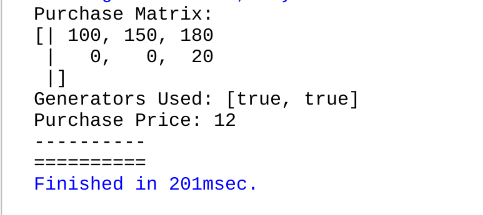
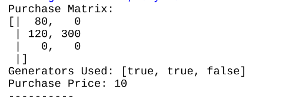
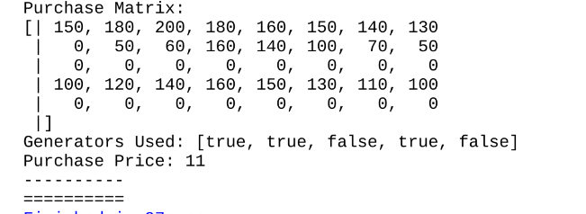
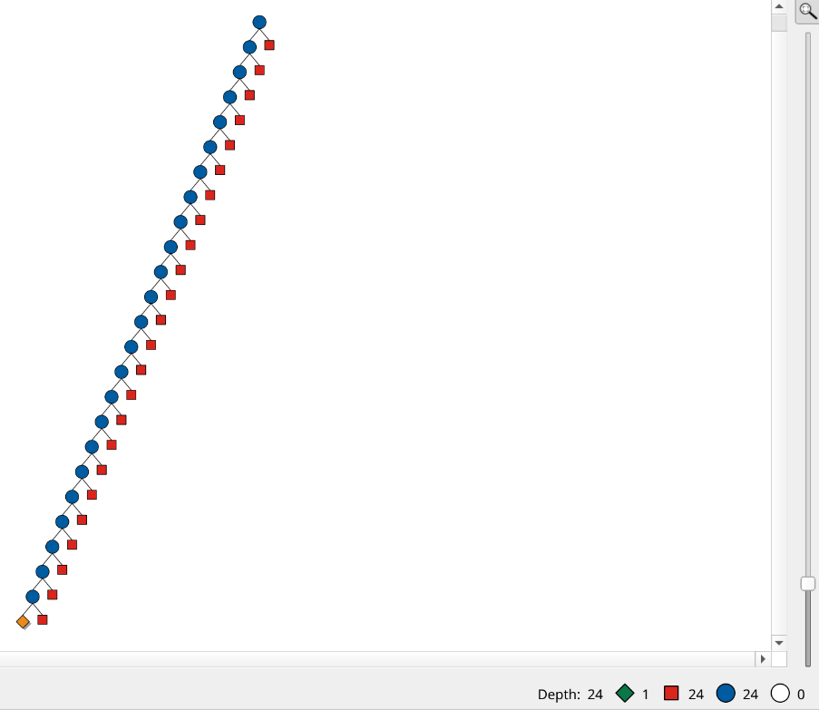
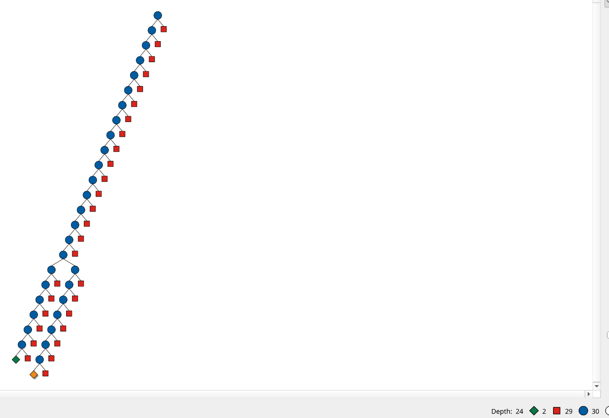
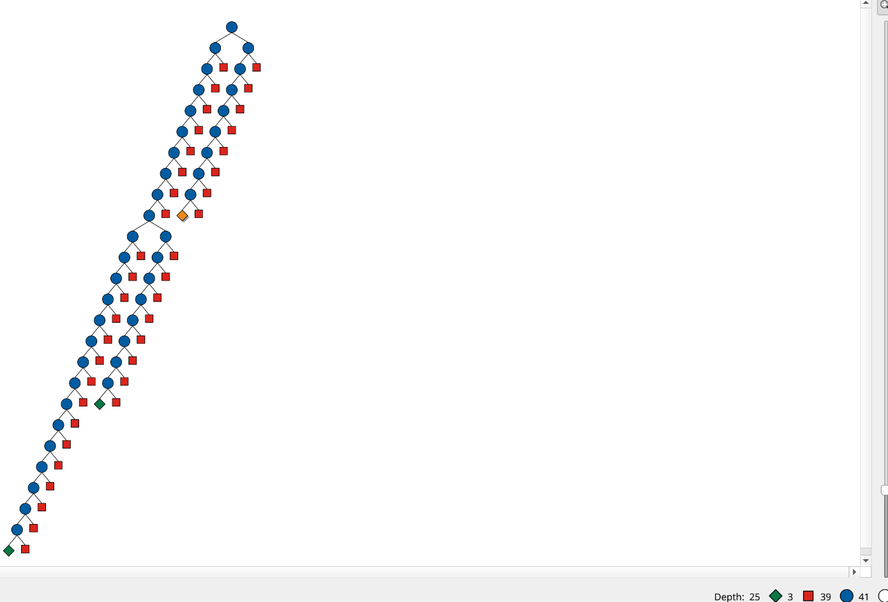

# Modelado de la Subasta del Mercado Eléctrico como un Problema de Optimización

**Autor(es):** [Tu nombre]  
**Fecha:** [Fecha actual]  
**Curso:** [Nombre del curso]  
**Profesor:** [Nombre del profesor]  

---

## 1. Introducción

Los mercados eléctricos son sistemas donde se realiza la compra y venta de energía eléctrica. En este contexto, la subasta del mercado eléctrico es un proceso clave para determinar qué generadores suministrarán energía, en qué cantidades y a qué precio, con el objetivo de satisfacer la demanda horaria al menor costo posible. Este documento describe el modelado de este problema como un problema de optimización, incluyendo sus variables, restricciones y función objetivo.

---

## 2. Descripción Detallada del Modelo de Optimización

Un problema de optimización se define mediante variables, restricciones y una función objetivo. A continuación, se detalla el modelado de la subasta del mercado eléctrico:

### 2.1. Variables

- **Variables de decisión:**  
  - $V_{ij}$: Representa la cantidad de energía (en MW) comprada al generador $i$ en la hora $j$, donde:  
    - $i \in \{1, \ldots, N\}$ (generadores).  
    - $j \in \{0, \ldots, M-1\}$ (horas del día, típicamente $M = 24$).  

- **Variable auxiliar:**  
  - $PC$: Precio de compra, definido como el máximo precio de venta ($PV_i$) entre los generadores seleccionados en cualquier hora.  

### 2.2. Parámetros del Problema

1. **Demanda:**  
   - $D_j$: Energía demandada en la hora $j$ (en MW).  
   - $P$: Precio máximo permitido por MW.  

2. **Oferta de generadores:**  
   - Para cada generador $i$:  
     - $C_{ij}$: Capacidad de producción (en MW) del generador $i$ en la hora $j$.  
     - $PV_i$: Precio de venta por MW del generador $i$ (siempre $PV_i \leq P$).  

### 2.3. Restricciones

1. **Satisfacción de demanda:**  
   La suma de energía comprada a todos los generadores en cada hora $j$ debe igualar la demanda:  
   $$
   \sum_{i=1}^{N} V_{ij} = D_j \quad \forall j \in \{0, \ldots, M-1\}.
   $$  

2. **Límite de producción:**  
   La energía comprada a cada generador $i$ en la hora $j$ no puede exceder su capacidad:  
   $$
   V_{ij} \leq C_{ij} \quad \forall i, j.
   $$  

3. **Precio de compra:**  
   El precio de compra $PC$ es el máximo precio de venta entre los generadores seleccionados:  
   $$
   PC = \max \{ PV_i \mid V_{ij} > 0 \text{ para algún } j \}.
   $$  

### 2.4. Función Objetivo

El objetivo es minimizar el precio de compra $PC$:  
$$
\text{Minimizar } PC.
$$  

---

## 3. Ejemplo Ilustrativo

### Datos del ejemplo:
- **Generadores:** $N = 2$.  
- **Horas:** $M = 4$.  
- **Demanda:** $D_1 = 100$, $D_2 = 120$, $D_3 = 200$.  
- **Capacidades:**  
  - Generador 1: $C_{11} = 120$, $C_{12} = 160$.  
  - Generador 2: $C_{23} = 180$, $C_{25} = 90$.  
- **Precios de venta:** $PV_1 = 10$, $PV_2 = 12$.  

### Solución propuesta:
1. Comprar al generador 1 siempre que sea posible (precio más bajo).  
2. Comprar al generador 2 solo cuando sea necesario para cubrir la demanda.  
3. **Precio de compra resultante:** $PC = 12$ (debido a la compra al generador 2).  

---

## 4. Implementación y Análisis

## 4.1 Código MiniZinc Utilizado


```minizinc
% Parametros de entrada

int: N;  % Número de generadores disponibles
int: M;  % Número de períodos de tiempo (normalmente 24 horas)

array[1..M] of int: demand;  % Demanda energética por hora [KW]
array[1..N, 1..M] of int: capacity;  % Capacidad de producción por generador y hora [KW]
array[1..N] of int: price;  % Precio de venta de cada generador

% Variables de decision

array[1..N, 1..M] of var int: purchase;  % KW comprados al generador i en la hora j
var int: purchase_price;  % Precio de compra (precio máximo entre generadores seleccionados)
array[1..N] of var bool: generator_used;  % Indica si el generador i fue utilizado

% Restricciones

% Limite de compra
constraint forall(i in 1..N, j in 1..M) (
  0 <= purchase[i,j] /\ purchase[i,j] <= capacity[i,j]
);

% Satisfaccion de demanda
constraint forall(j in 1..M) (
  sum(i in 1..N) (purchase[i,j]) == demand[j]
);

% Generadores utilizados
constraint forall(i in 1..N) (
  generator_used[i] <-> (sum(j in 1..M) (purchase[i,j]) > 0)
);

% Calcular precio
constraint purchase_price = max([if generator_used[i] then price[i] else 0 endif | i in 1..N]);

% Estrategia de solucion
solve :: int_search(purchase, input_order, indomain_max, complete)
      minimize purchase_price;
      
      
% Salida
output [
  "Matriz de Compras:\n",
  show2d(purchase),
  "\nGeneradores Utilizados: ", show(generator_used),
  "\nPrecio de Compra: ", show(purchase_price), "\n"
];
```

## 4.2 Pruebas de funcionamiento con varias instancias

### Primera instancia, ejemplo del enunciado

```minizinc
      % Example data for Electricity Market Auction

N = 2;  % 2 generators
M = 3;  % 3 hours

demand = [100, 150, 200];  % Demand for each hour

capacity = [| 120, 160, 180  % Capacity of generator 1 for each hour
            | 90, 140, 220 |]; % Capacity of generator 2 for each hour

price = [10, 12];  % Selling prices for generators 1 and 2
```

### resultado



### Segunda instancia

```minizinc
    

N = 3;  % 3 generators
M = 2;  % 2 hours

demand = [200, 300];  % Demand for each hour

capacity = [| 100, 150   % Capacity of generator 1 for each hour
            | 120, 300   % Capacity of generator 2 for each hour
            | 150, 200 |]; % Capacity of generator 3 for each hour

price = [10, 5, 15];  
```

### resultado



### Tercera instancia

```minizinc
      % Larger example data for Electricity Market Auction

N = 5;  % 5 generators
M = 8;  % 8 hours

demand = [250, 350, 400, 500, 450, 380, 320, 280];  % Demand for each hour

capacity = [| 150, 180, 200, 180, 160, 150, 140, 130   % Capacity of generator 1 for each hour
            | 120, 140, 150, 180, 190, 170, 150, 130   % Capacity of generator 2 for each hour
            | 200, 220, 230, 240, 220, 200, 180, 170   % Capacity of generator 3 for each hour
            | 100, 120, 140, 160, 150, 130, 110, 100   % Capacity of generator 4 for each hour
            | 180, 200, 210, 220, 210, 190, 170, 160 |]; % Capacity of generator 5 for each hour

price = [9, 11, 13, 8, 12];  % Selling prices for generators 1-5
```




### 4.3. Estrategias de Distribución Evaluadas

En MiniZinc, la distribución de valores en las variables puede influir significativamente en el rendimiento de la resolución del problema. Se probaron las siguientes estrategias con la ultima instancia que se mostro anteriormente:

1. **first_fail**: Selecciona primero la variable con el dominio más pequeño, lo que ayuda a reducir rápidamente el espacio de búsqueda.

   ```minizinc
      solve :: int_search(purchase, first_fail, indomain_max, complete)
      minimize purchase_price;
   ```

   

2. **smallest**: Prioriza la asignación de valores a las variables con los valores más pequeños en su dominio.

   ```minizinc
      solve :: int_search(purchase, smallest, indomain_max, complete)
      minimize purchase_price;
   ```

   

3. **input_order**: Asigna valores en el orden en que las variables aparecen en el modelo, sin heurísticas avanzadas.

   ```minizinc
      solve :: int_search(purchase, input_order, indomain_min, complete)
      minimize purchase_price;
   ```

   


4.4 Análisis Comparativo de Estrategias de Búsqueda para el Problema del Mercado Eléctrico

## Estrategias Evaluadas

### 1. Estrategia `first_fail`  
**Características del árbol de búsqueda**:  
- Forma lineal y profunda (24 niveles)  
- 24 nodos solución (azules)  
- Solo 1 nodo de fallo (rojo)  

**Ventajas**:  
✅ Detección temprana de fallos  
✅ Propagación eficaz de restricciones  
✅ Mínimo backtracking (solo 1 nodo fallido)  
✅ Estructura predecible  

**Desventajas**:  
❌ Exploración limitada del espacio de soluciones  
❌ Riesgo potencial de óptimos locales en problemas complejos  
❌ Menos efectivo con restricciones poco ajustadas  

---

### 2. Estrategia `smallest`  
**Características del árbol de búsqueda**:  
- Estructura semi-lineal con ramificación final  
- 30 nodos solución  
- 29 nodos fallidos  

**Ventajas**:  
✅ Balance entre eficiencia y exploración  
✅ Examina valores alternativos en variables clave  
✅ Útil para encontrar soluciones cercanas al óptimo  

**Desventajas**:  
❌ Mayor backtracking (29 nodos fallidos)  
❌ Costo computacional más alto (59 nodos totales)  

---

### 3. Estrategia `input_order`  
**Características del árbol de búsqueda**:  
- Árbol ancho y ramificado  
- 41 nodos solución  
- 39 nodos fallidos  

**Ventajas**:  
✅ Exploración exhaustiva del espacio de soluciones  
✅ Identifica múltiples alternativas  
✅ Útil para análisis pedagógicos  

**Desventajas**:  
❌ Alto costo computacional (80 nodos totales)  
❌ Ineficiente para encontrar rápidamente el óptimo  

---

## Comparativa Global  

| Métrica         | `first_fail` | `smallest` | `input_order` |
|-----------------|-------------|-----------|--------------|
| **Nodos totales** | 25          | 59        | 80           |
| **Nodos solución** | 24          | 30        | 41           |
| **Nodos fallidos** | 1           | 29        | 39           |
| **Profundidad**    | 24 niveles  | 24 niveles| 25 niveles   |

**Eficiencia computacional**:  
`first_fail` > `smallest` > `input_order`  

**Diversidad de soluciones**:  
`input_order` > `smallest` > `first_fail`  

---

5. Conclusión  

🔹 **Para optimización pura**:  
`first_fail` es la mejor opción por su eficiencia y mínimo backtracking.  

🔹 **Para análisis exploratorio**:  
`input_order` permite entender mejor el espacio de soluciones.  

🔹 **Balance ideal**:  
`smallest` ofrece un compromiso razonable entre eficiencia y exploración.  

> **Nota**: La elección final depende de los objetivos específicos del modelado (velocidad vs. exhaustividad).  

